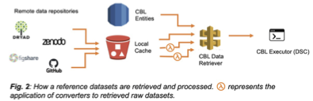

## datasets (DS entities)

DS entities specify the source of reference files and their formats. DS entities contain:
•	Meta information, such as author, creation date, and license.
•	URLs to physical files stored in repositories such as DRYAD, figshare, zenodo, and GitHub, which is optional because datasets can be generated on the fly using converters. A cryptographic hash algorithm (e.g., SHA-256) will be used to ensure the integrity of downloaded files.
•	Optional convertors and their parameters to redact or enrich input files (Fig. 2).
•	Statistics generated by dataset summarizers can be properties for querying and selecting datasets with specific properties, determining parameters for computational tools, and visualizing benchmarking results. For example, number of sequences, read length, and mean inner distance of next-gen sequencing data could be generated by a summerizer and be used by sequencing alignment tools.
•	Optional “ground truth” of the dataset if it contains a known true signal. Simulated datasets generally contain ground truths (e.g., known disease susceptibility variants for simulated phenotypes), whereas experimentally obtained datasets usually do not contain ground truth, except if they contain “spike-in” signals (e.g., ‘spiking’ known concentrations of synthetic RNA (58) in RNA-seq experiments) (59-61).

FT entities dictate how physical files will be retrieved and processed (Fig. 2). For example, the same datasets could be retrieved as individual files using separate FT entities or as a set of files using a combined FT entity. In addition, using converters allows the same physical datasets to be exposed to computational tools in different formats. Specifically, converters can be used to
1.	Process input files, e.g., generating an uncompressed input file if a computational tool requires it.
2.	Filter input files, e.g., selecting only single nucleotide polymorphisms from an input variant list if required by a computational tool or drawing random samples from the input file to simulate random population samples.
3.	Augment input files with additional annotation, such as the name of a single nucleotide polymorphism.
4.	Simulate input files so all datasets will be generated on the fly. This function is extremely useful for benchmarking studies with a large number of small datasets.
