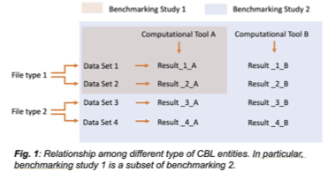

# CBL
Common Benchmark Language Specification

CBL consists of a set of data-exchange format and protocols for the description and exchange of a wide variety of benchmarking studies. It ensures that studies represented in this format can be managed and shared through a CBL-aggregation service like the proposed BioBenchmark.org. However, a benchmarking study in CBL format may not contain all the information for it to be reproducible, and CBL executors will have varying capacity to execute different types of benchmarking studies in the CBL format. In particular, a CBL-based benchmarking study could be converted from an existing benchmarking study and contain only text-based descriptions of the benchmarking process and structured results. Such studies cannot be reproduced automatically but could still be shared and visualized by BioBenchmark.org.

## Overall design of CBL.

The CBL format will be designed as a set of specifications, called “entities,” that specify all aspects of benchmarking studies. As illustrated in Fig. 1, CBL consists of specifications for

1.	File Types (FT entities) that specify the formats of input and output of computational tools,
2.	Data Sets (DS entities) that specify actual datasets with specified file types,
3.	Computational Tools (CT entities) that specify how to install genomic data analysis tools and use them to analyze DSs, including the FT of input and output files,
4.	RESults (RES entities) that specify the results of analyzing a DS using a particular CT, Instead of outputs themselves, RES entities contain structured and annotated data extracted from benchmark outputs.
5.	Performance Metrics (PM entities) that specify the metrics that can be compared across computational tools and datasets, and
6.	Benchmarking Studies (BS entities) that consist of DSs, CTs, PMs and optionally their RESs.

All these entities will be individually defined and stored and have their own unique IDs, which consists of a name and an optional version tag. Like tags used by other systems, such as docker, a “tagged entity” is a frozen snapshot of an entity and an “untagged entity” refers to the latest version of an entity. Different versions of the same entities can be used to create benchmarking studies that compare the performance of different versions of the same computational tools.
CBL entities, being structured texts, can be stored locally or remotely in any format. They are immutable and loosely coupled in that they cannot be modified once frozen. CBL entities can be referred to by their IDs, regardless of their location and storage format (locally or remotely in a CBL aggregator, in plain-text format or databases, see Section C.2.1). The immutability of CBL entities ensures that a benchmarking study will be reproducible, and the coupling of CBL entities allows benchmarking study components to evolve independently.

In addition to CBL entity format, the CBL standard will include a protocol using the CBL entities exchanged between a client (e.g., a benchmark management system) and a server (CBL entity repositories, called aggregators). This protocol allows a client to use CBL entities from and share CBL entities to a centralized repository and allows 1) web-based visualization of benchmark results, 2) distributed computation of large-scale collaborative benchmarking studies, and 3) continuous update and expansion of benchmarking studies.
